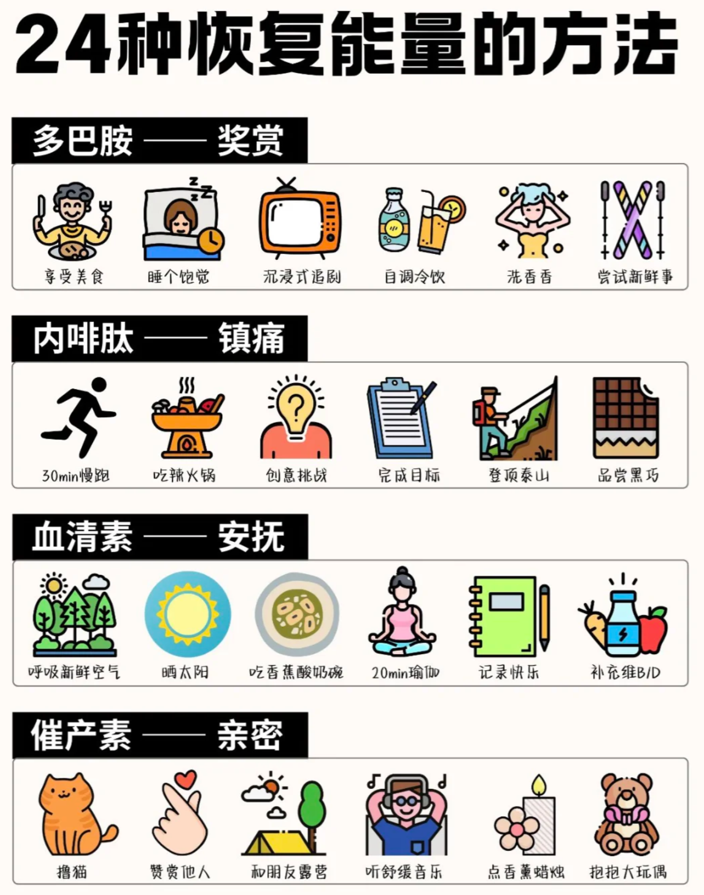

👋我在想我们生活中有太多廉价多巴胺，及时行乐很开心，事后也总感觉空洞。

##### 我从什么事情上获得不健康的多巴胺

- 反复查阅消息
- 刷视频
- 短暂的专注又打开手机

> 通过快速的切换信息来获取刺激，从而逃避需要思考的当下。我注意到这会损害专注力、情绪、以及思考能力。

##### 健康的获取能量

同时，我也收集到如何减少手机使用频率的办法：
- 意识到：不会错过重要的消息是戒掉手机的第一步
- 行为习惯暗示：在手里握着一个其他的东西，比如一个小的记事本
- 心理暗示：我不玩手机和我不能玩手机这两种表述，前者有更好的心理暗示
- 大脑中的奖励结构是固定的：因此必须要制造玩手机的困难，比如将手机放置视线之外、关闭消息提示

  