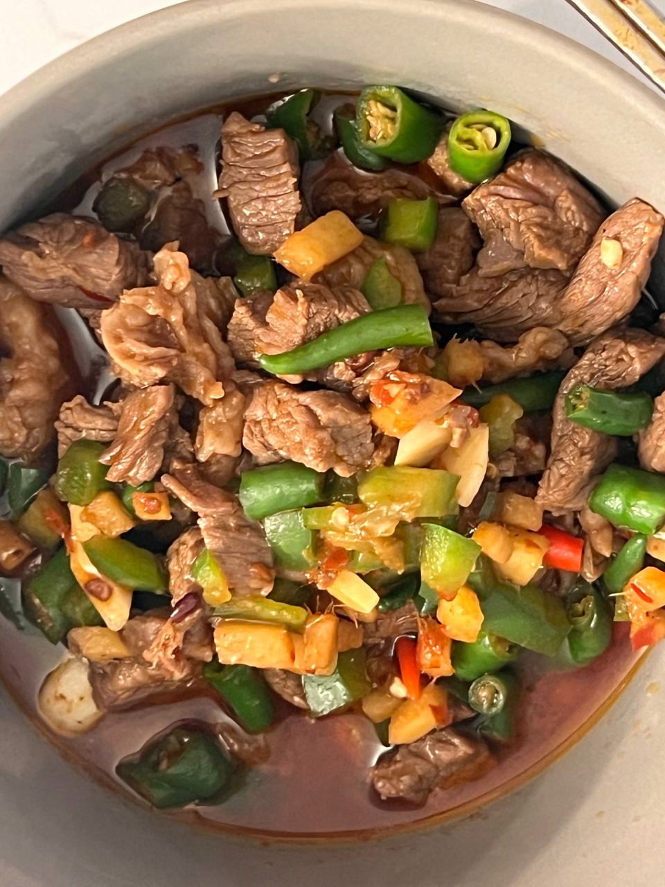
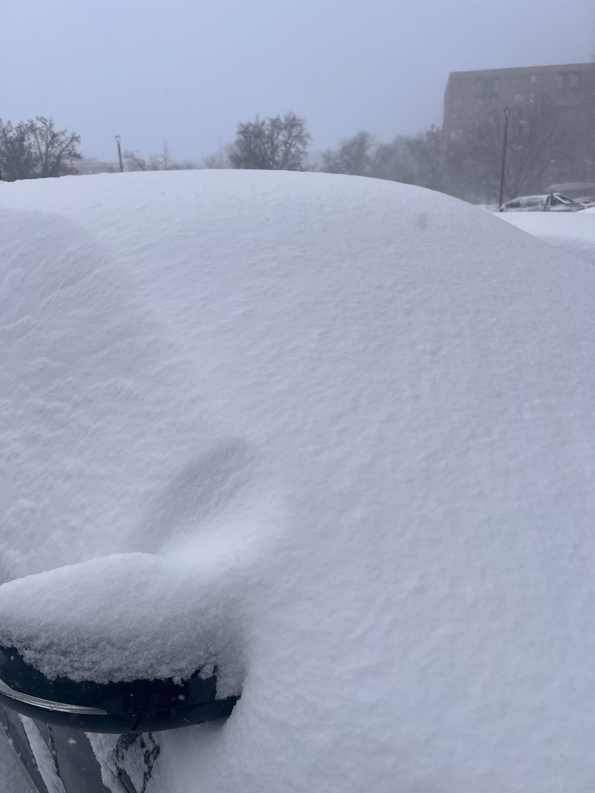
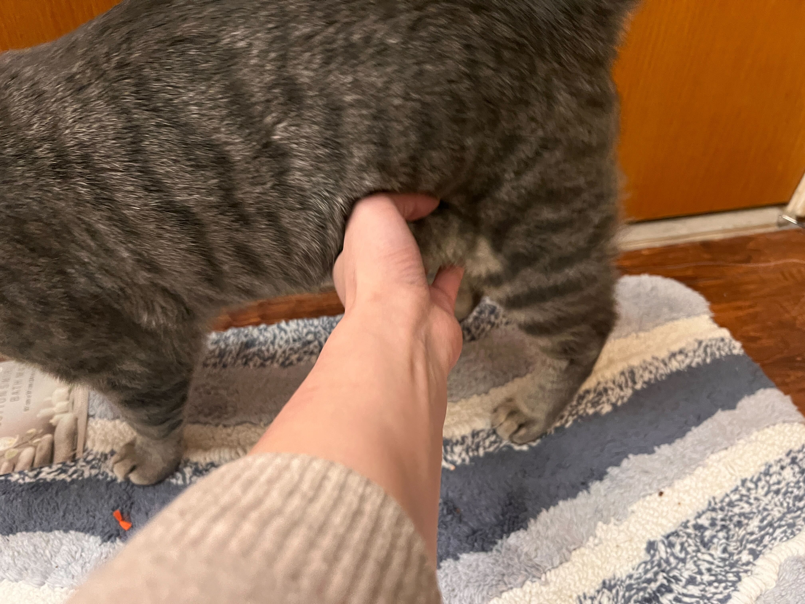
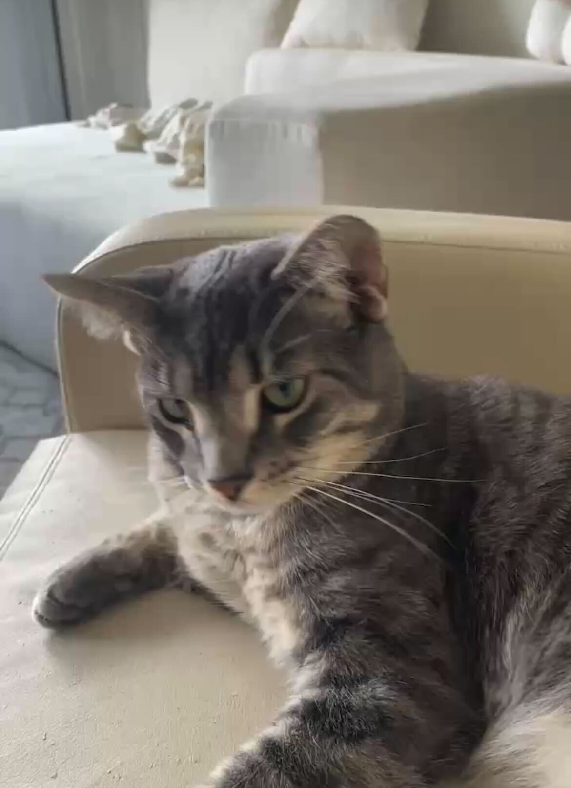

## Manuscript

这周过的神魂颠倒，尤其是周五早上凌晨四点飞机前，我决定通宵留在实验室修改论文，企图在起飞前把论文草稿发给Dr. Kou。但是拼尽全力没有完成，只能火速拷贝了绘图资料，再确认远程连接的可用，就出发去机场了。航班先从克利夫兰到芝加哥，再从芝加哥转机到旧金山，期间虽然困的乏力，但是再拖就要完蛋了，于是在飞机上继续搓论文，终于在抵达旧金山时完成了第一版编辑，发给了Dr. Kou。

## 会议PPT修改

博后和本科生学妹写论文过程中，曹老板会来回修稿，Word蓝色修改痕迹几乎覆盖了原文。博后和学妹震惊老板已经无敌忙碌，竟然还有能量在短时间内亲力亲为细致批阅修改学生论文。对我而言，一方面老板认真修改的兜底让我安心，另一方面我为老板修改过程中的头疼和叹息感到抱歉。（曹老师对不起，我写得烂）

这周日由于SPIE会议汇报，所以老板和我预约PPT的review session。第一次review时PPT还差一半没做好。因为实在是手忙脚乱，忙于补实验，处理数据和修改文章，PPT并没做完，硬着头皮发给了老板。

Zoom review时，每一页PPT老板都详尽审阅，包括文本间隙处等空格，标题大小写，引用文献格式，内容整体比例，对称性，图片对比度这类格式与展示细节，以及检查每一页PPT的标题是否简要完全，内容是否渐进易懂，整体逻辑性、故事性是否完整等等。审阅中途发现有漏洞又回滚进行查漏补缺。反复调整直到清晰美观。所有修改他都一一帮我修改好，最后再发给我。

第二天的review依旧详尽，第三天老板在飞机上又对改版PPT批注良多，pre前一天在会场和我一对一排练。

世界上按照待人待己的严苛标准可以分为四类人，其中以严于律己，宽以待人最值得敬佩。而现实中，宽于律己，严以待人的却占大头。与我而言，我曾经属于后者，爱说教但不以身作则。说教能产生凭空的自信，而不以身作则似乎也没有代价，因此爱说但是少做，本质上也是沉迷于廉价又快速的多巴胺。曹老师是前者，并且能力卓越，我想我虽然不能超越他，但是至少不要再做四象限中最次的一类。

## SPIE报告

在SPIE完成了人生中第一次会议演讲。
<figure style="text-align:center; margin: 2em 0;">
  
</figure>

<figure style="text-align:center; margin: 2em 0;">
  
</figure>
会议前一小时非常紧张，但是好朋友Marian用心陪我聊天甚至主动提出和我排练让我觉得很暖心！上台后反而不紧张了。

QA环节有缺陷，说实话俩提问者的问题第一遍我都没有听清楚。引导问题的过程不太礼貌。第一个提问者我回复过于直白，一句 sry,is your question about how we perform the apodization?应该先感谢，再说is your question about xxx。

第二个提问者的问题我理解了半天，貌似是询问我elevational resolution是啥，虽然大受震撼（我的pre是关于如何提高elevational resolution），但是说明我的背景slice默认把专业常识当做了共识，之后应该增加相关描述。

会议后和林励教授短暂交谈，林励老师是汪老师组的博士与博后，也是曹老板同门，交流了一些算法原理细节。晚上的poster session拿啤酒时又偶遇林博士，林博士赞许曹老板格局高，让我跟着他好好好干。我是绝无二心的，一直很佩服老板。 

我和林老师在会场偶遇多次，但是每一次事加微信我都后知后觉。第三次偶遇，反倒是林老师提出加个联系方式，估计是被小辈弄无语了。咱社交技能拉垮，特别是向上社交这一块，通过申请后，破冰消息也不知如何措辞。与之相反的是，会议上有一个哥，我在拿茶水的时候碰见他在和两位大佬社交，其中一位大佬对其高情商夸赞有加。当天下午的最佳论文比赛现场后，Lihong离场时，他也立马起身小跑上前，抓住这个间隙介绍自己。相比之下，我根本不敢上前，就算豁出去，说话也肯定支支吾吾弄巧成拙。

## 生活

买了铁锅，重新爱上做饭！已经学会酸辣土豆丝，双椒碎牛肉，炒油菜花
<figure style="text-align:center; margin: 2em 0;">
  
</figure>
克利夫兰下了很恶劣的雪，学校因此提前关闭，但是由于办公软件安装在学校电脑上，只能去学校。在车里呆了二十分钟等玻璃上的冰化掉。

<figure style="text-align:center; margin: 2em 0;">
  
</figure>

出发去机场前最后摸一摸小猫的肥肚肚。
<figure style="text-align:center; margin: 2em 0;">
  
</figure>

室友发来的小猫照片，很霸道。

<figure style="text-align:center; margin: 2em 0;">
  
</figure>

### 输入

#### 文章
[脖子以下](https://www.kele.me/p/neck-down "https://www.kele.me/p/neck-down") 不问自己要不要做，只是让脖子以下的身体行动起来。

[How to Journal Like 
](https://readsurrounded.substack.com/p/how-to-journal-like-haruki-murakami) 内省常被当作采矿。我们试图直直挖掘黑暗寻找宝石。但准确的日记其实更像是土地测量。保持坦诚，坚持记录，如果专注于捕捉一天中无害的细节，你就能根据自己的行为看到真实的感受。你停止试图直视自己的人生去寻找真相。相反，你只是坐在车旁，看着路，让真相自然而然地到来。
 
 #### 电影
[甜蜜蜜](https://sec.douban.com/c?r=https%3A%2F%2Fmovie.douban.com%2Fsubject%2F1305164%2F&_s=2e3ec71d4bca13d118c2fc4581188375096d660c6d20fb9947eb4bcb1cf38cf6&a=1) 二刷，故事最后像是he，但是现实中很难有如此多巧合造就的结局。‘没有一个人一生只爱一个人‘

[本杰明巴顿奇事](https://m.douban.com/movie/subject/1485260/) 我希望我可以当你爸爸，没有什么能比这更魂牵梦萦。

[茶馆](https://m.douban.com/movie/subject/1461403/) 演技都很棒，通过茶馆与茶馆中的人物反应旧中国的变迁，不变的是对底层百姓的欺压。

[机器人之梦](https://m.douban.com/movie/subject/35426925/) 如果更早看过，是否会更早释怀。爱不是刻舟求剑的回忆，而是永远在那时那刻熠熠闪光的真诚 

#### 书籍

[可能性的艺术](https://m.douban.com/book/subject/35819419/) 

#### 播客

[成长就是对自己祛魅](https://www.xiaoyuzhoufm.com/episode/695f86ced4b8fa56f5ea4aa0?s=eyJ1IjogIjY5NjE3ZTZlMjU0ZmJjYTQ3MDg3NTcwMiJ9) 成长的一个维度是接受了世界非对等的逻辑，甚至不把他看作是不公平。

[EP1 刘嘉玲说，60岁是她的黄金时代](https://www.xiaoyuzhoufm.com/episode/6965e110ef1cf272a71cf2e3?s=eyJ1IjogIjY5NjE3ZTZlMjU0ZmJjYTQ3MDg3NTcwMiJ9) 能听到刘嘉玲对于生活的态度和感悟挺好的

